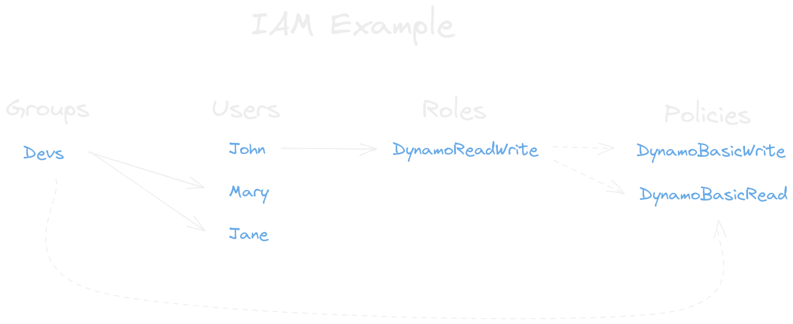
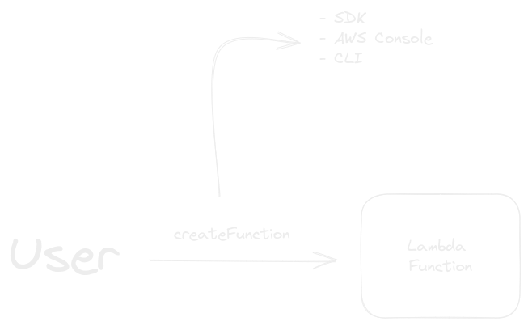

#aws 
#aws-iam
#cloud

## AWS IAM

To use IAM:

**Go to Search > IAM**

- Core AWS Service that helps you control access to **Resources**
- **Resources** are thje entities you create, for example **AWS, S3 Bucket or Lambda**
- Users attempt to perform **Actions** on resources, for example **S3::CreateBucket**
- **Roles** are collection of policies (DB Read, DB Write)
- Authorization to perfom an **Action** depends on a **Policy**
- **Policy** is a JSON document thats specifies user permission
- Instead of use Root, create an user and give **AdministratorAccess** Policy

## Tips

- Protect your **Root Account** at all costs
- Explicit **Effect 'Deny'** wins over **Effect 'Allow'** 
- Use the **Least Privilege Model**
- Use http://policysim.aws.amazon.com to simulate policy statement 
- CloudTrail to track user activity



### Policy 

IAM policies are JSON documents that define what actions are allowed or denied on AWS resources. Policies can be attached to users, groups, or roles, and they specify the permissions for those entities. AWS provides pre-defined policies for common use cases, and you can create custom policies as needed.




Policy example:

```json
{
  "Version": "2021-10-16",
  "Statement": [
    {
      "Sid": "CreateFunction",
      "Effect": "Allow",
      "Action": [
        "lambda:createFunction",
      ],
      "Resource": "*"
    }
  ]
}
```


- **Statement**: Tells what we are allowed or not allowed to do
- **Effect**: Allow or Denied

### Access Key and Secret Access Key

IAM users can have access keys (access key ID and secret access key) for programmatic access to AWS services using APIs and SDKs. Access keys are typically used by developers and applications.

- **Secret**: Codes that you use to interact with AWS

## Groups

You can organize IAM users into groups, making it easier to manage permissions for multiple users who require the same access rights. Instead of assigning permissions individually to each user, you can assign permissions to groups.

## Roles

IAM roles are similar to users but are intended for AWS services, applications, or other entities that need temporary access to AWS resources. Roles are often used for cross-account access or for granting permissions to AWS services like EC2 instances.

## User

IAM allows you to create individual IAM users for people or applications that need access to AWS resources. Each user has a unique set of credentials for authentication.

### How to create a User

To create a user go to IAM > Users > Create user 

Some use cases:

- **Developers**: Sign in with limited permissions
- **Accounting**: Specic role to see billing dashboard 

**Enable AWS Management Console access**:

If you want to enable console access you will need to create an **IAM** user or specify an user in **IAM Identity Center**

- **Identity Center**: For administrative users
- **IAM**: For developers

### How to attach policy

Select user > add permission to attach policy.

- Add permission
- Create inline policy: For more specific scope

>If you want to give permission for billing, in root account you need to activate **IAM user and role access to Billing information** in settings 


## MFA

IAM supports MFA, adding an additional layer of security to user accounts by requiring a second authentication factor (such as a time-based one-time password) in addition to a password.


