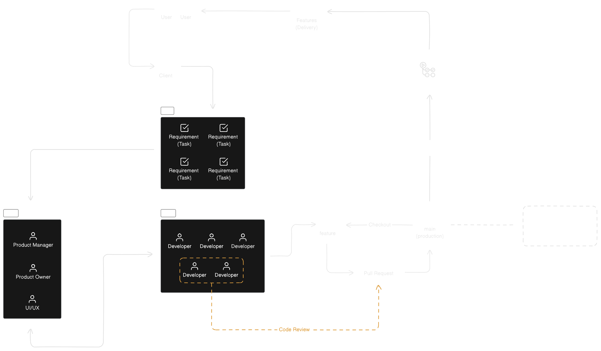

#git 

# What does larger scale software development look like?

- User 
- Client (Customer/Boss) - It depends what kind work you are doing
- UX/UI
- Scrum Master and Product Manager
- Developers
- Git Flow approach

# Trunk Based Development

- Its an alternative for **Git Flow**
- Work as well for squads (1 - 10 members)
- Use Pull Request feature to ship features to main branch
- Merge daily (or as soon as possible)
- **Short** PR, for fast **Code Review**
- Use unit and integration test
- Use GitHub Actions
- tag releases
- Feature Flags to enable and disable things you want or not to be in production

trunk based diagram

