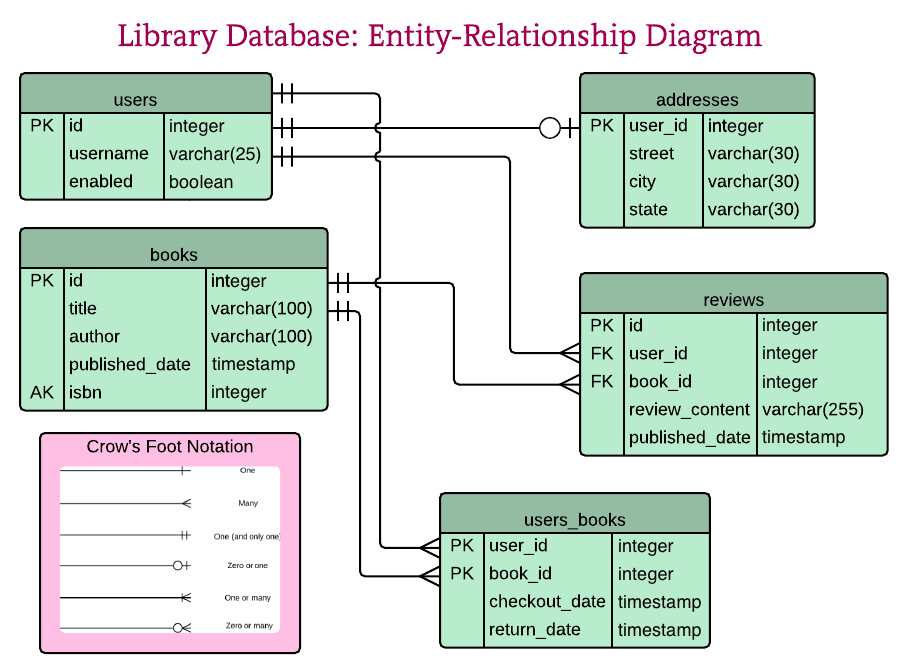

# PostgreSQL

Category: Roadmap
Last edited time: July 22, 2022 1:41 PM

# Resources

- [https://launchschool.com/books/sql_first_edition/read/introduction](https://launchschool.com/books/sql_first_edition/read/introduction)
- [https://www.postgresqltutorial.com](https://www.postgresqltutorial.com/)
- [https://roadmap.sh/postgresql-dba](https://roadmap.sh/postgresql-dba)

[How To Install and Use PostgreSQL on Ubuntu 20.04](How%20To%20Install%20and%20Use%20PostgreSQL%20on%20Ubuntu%2020%2004%209601fd852851406d99effb53ed0360e0.md)

# Concepts

Primary Key

Unique Key

Domains

# Commands

```bash
\dt
\d+ cid
\d bai
```

# Connect to PGSQL

```bash
pgsql -U

```

# SQL Commands

```sql
SELECT 
```

# Relationship



- One-to-Many
- Many-to-Many
- -
- [https://launchschool.com/books/sql_first_edition/read/multi_tables](https://launchschool.com/books/sql_first_edition/read/multi_tables)